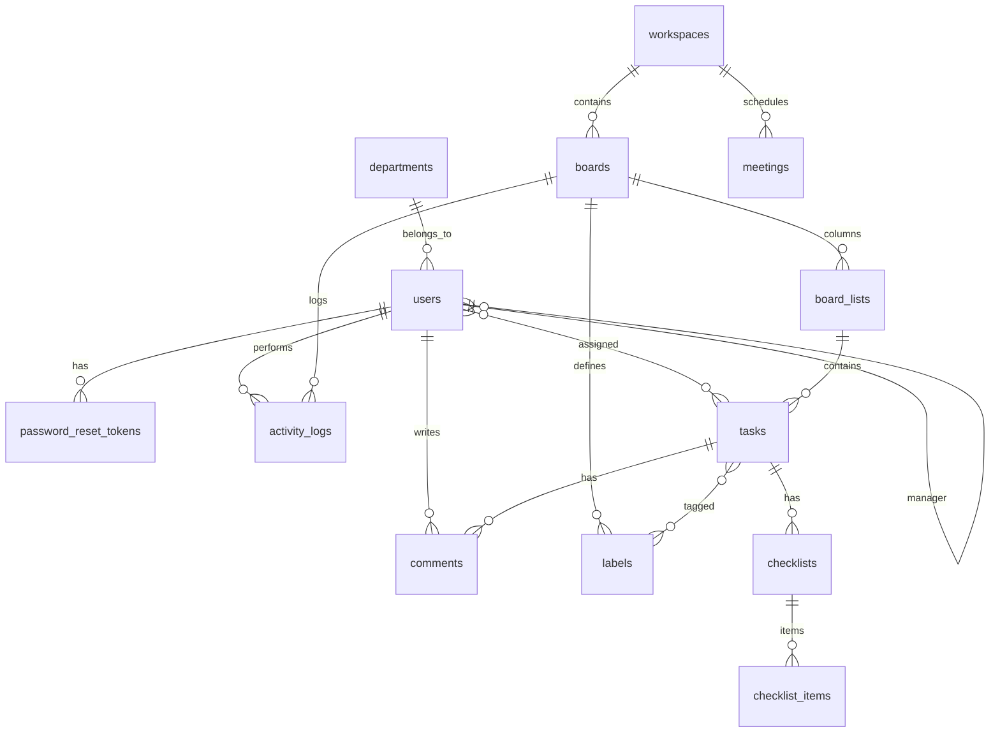
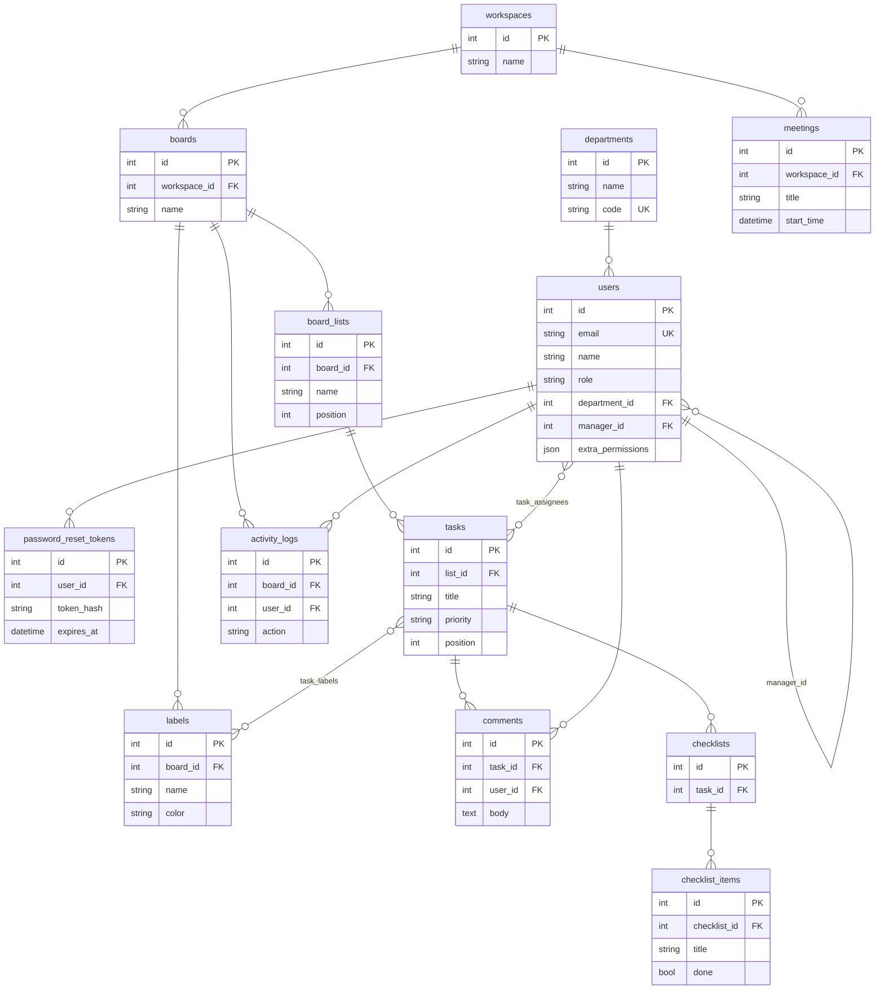

# Backend database — ER diagram

Generated from SQLAlchemy models in [`backend/app/models.py`](../backend/app/models.py).

## Diagram (Mermaid)

Paste into [Mermaid Live](https://mermaid.live) or any Markdown viewer that supports Mermaid (GitHub, many IDEs).

### Relationships only (compact)

### With key columns (detail)

> **Note:** M:N links `task_assignees` (tasks ↔ users) and `task_labels` (tasks ↔ labels) are implied by `users }o--o{ tasks` and `tasks }o--o{ labels` in the compact diagram; junction tables are not drawn as separate entities here.

## Relationship summary

| From | To | Cardinality | Notes |
|------|-----|--------------|--------|
| `departments` | `users` | 1:N | Optional `department_id` on user |
| `users` | `users` | 1:N | `manager_id` → manager (org hierarchy) |
| `users` | `password_reset_tokens` | 1:N | Cascade delete |
| `workspaces` | `boards` | 1:N | |
| `workspaces` | `meetings` | 1:N | |
| `boards` | `board_lists` | 1:N | Kanban columns |
| `boards` | `labels` | 1:N | Unique `(board_id, name)` |
| `boards` | `activity_logs` | 1:N | |
| `board_lists` | `tasks` | 1:N | |
| `tasks` | `users` | N:M | Table `task_assignees` |
| `tasks` | `labels` | N:M | Table `task_labels` |
| `tasks` | `comments` | 1:N | |
| `tasks` | `checklists` | 1:N | |
| `checklists` | `checklist_items` | 1:N | |
| `users` | `comments` | 1:N | Author |
| `users` | `activity_logs` | 1:N | Actor |

## Enums (stored as string in DB)

- **`tasks.priority`**: `urgent`, `high`, `medium`, `low`
- **`meetings.status`**: `scheduled`, `live`, `ended`

---

*Regenerate this doc if `models.py` changes.*
